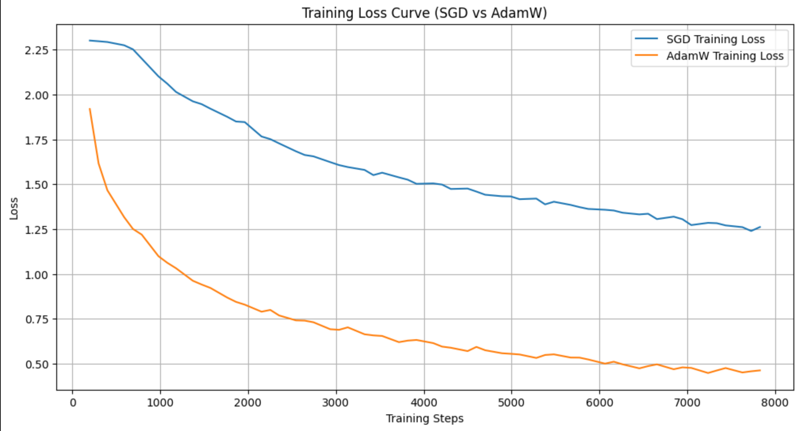
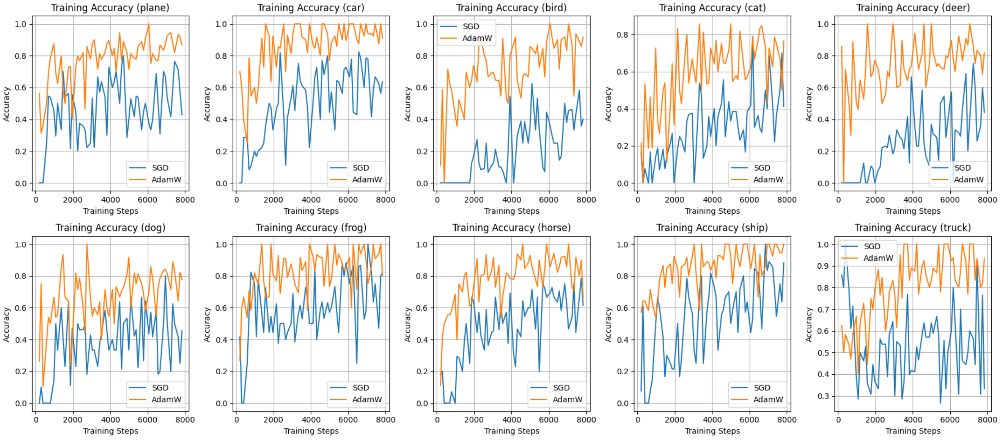

В данном задании было необходимо сравнить время сходимости алгоритмов: SGD и AdamW. Для сравнения использовалась сверточная нейронная сеть и датасет cifar-10
Были получены следующие результаты:




```
Accuracy of the network trained with SGD on the 10000 test images: 57%
Accuracy per class on the test set (trained with SGD):
Accuracy for class: plane is 75.9 %
Accuracy for class: car   is 59.5 %
Accuracy for class: bird  is 44.8 %
Accuracy for class: cat   is 40.2 %
Accuracy for class: deer  is 49.0 %
Accuracy for class: dog   is 50.3 %
Accuracy for class: frog  is 52.4 %
Accuracy for class: horse is 76.2 %
Accuracy for class: ship  is 59.0 %
Accuracy for class: truck is 63.6 %

Accuracy of the network trained with AdamW on the 10000 test images: 80%
Accuracy per class on the test set (trained with AdamW):
Accuracy for class: plane is 82.2 %
Accuracy for class: car   is 91.9 %
Accuracy for class: bird  is 70.1 %
Accuracy for class: cat   is 66.1 %
Accuracy for class: deer  is 72.9 %
Accuracy for class: dog   is 73.9 %
Accuracy for class: frog  is 89.9 %
Accuracy for class: horse is 87.7 %
Accuracy for class: ship  is 84.1 %
Accuracy for class: truck is 90.7 %
```
Таким образом, AdamW значительно превзашел SGD в скорости обучения.
