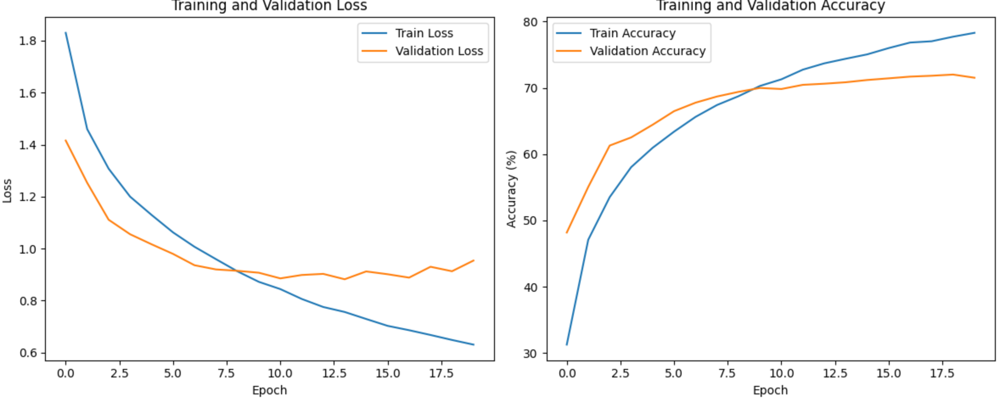
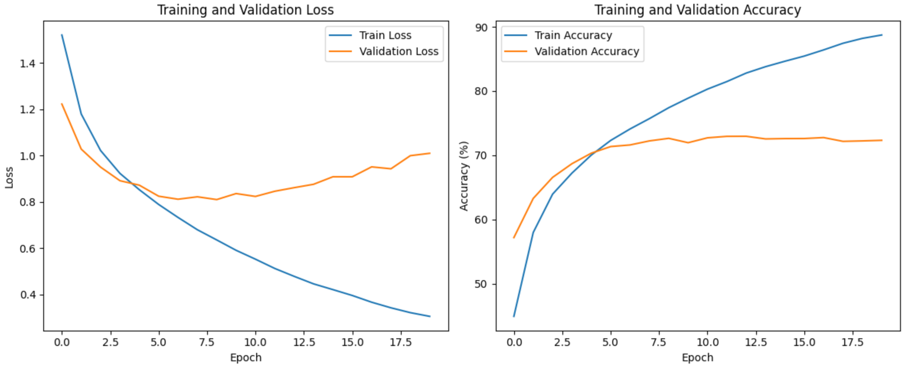

В данном задании необходимо было подобрать оптимальные параметры ("n_units", 4, 128) ; ("n_layers", 1, 5) с импользованием паекта optuna для сети с архитектурой: Conv2D - Flatten - {Linear - ReLU - Dropout} * n_layers

[I 2024-12-20 14:33:34,481] A new study created in memory with name: no-name-d2d30398-69ea-4123-b8f0-f87ce1050c43\
...\
[I 2024-12-20 14:34:10,562] Trial 2 finished with value: 0.40859375 and parameters: {'n_layers': 3, 'n_units_l0': 84, 'n_units_l1': 64, 'n_units_l2': 26}. Best is trial 0 with value: 0.515625.\
...\
[I 2024-12-20 14:40:12,140] Trial 83 finished with value: 0.56640625 and parameters: {'n_layers': 1, 'n_units_l0': 99}. Best is trial 83 with value: 0.56640625.\
...\
Study statistics:\
  Number of finished trials:  100\
  Number of pruned trials:  81\
  Number of complete trials:  19\
Best trial:\
  Value:  0.56640625\
  Params:\
    n_layers: 1\
    n_units_l0: 99\

В результате оптимизации, оптимальными значениями параметров стали: {n_layers: 1; n_units_l0: 99}

Сравним лучшие значения параметов, со средними на полном цикле обучения:

Training model: avg_model\
Epoch 1/20, Train Loss: 1.8299, Train Acc: 31.27%, Valid Loss: 1.4157, Valid Acc: 48.17%\
...\
Epoch 19/20, Train Loss: 0.6488, Train Acc: 77.71%, Valid Loss: 0.9130, Valid Acc: 72.00%\
Epoch 20/20, Train Loss: 0.6308, Train Acc: 78.29%, Valid Loss: 0.9540, Valid Acc: 71.52%\

Training model: best_model\
Epoch 1/20, Train Loss: 1.5204, Train Acc: 44.92%, Valid Loss: 1.2222, Valid Acc: 57.18%\
...\
Epoch 13/20, Train Loss: 0.4779, Train Acc: 82.80%, Valid Loss: 0.8609, Valid Acc: 72.96%\
...\
Epoch 20/20, Train Loss: 0.3051, Train Acc: 88.73%, Valid Loss: 1.0094, Valid Acc: 72.33%\

Таким образом, лучшие параметры обучения показали большую лучшую точность: 72.96% (best_model) vs 72.00% (avg_model)
